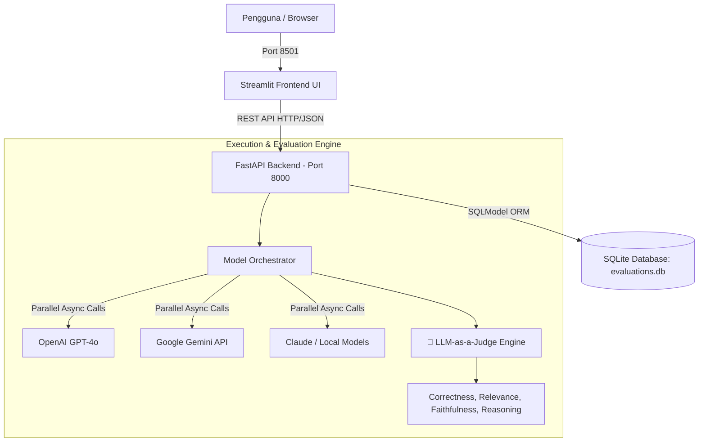

# ✨ Neural Eval Core — LLM Evaluation & Prompt Engineering Dashboard

[](https://python.org)
[](https://fastapi.tiangolo.com)
[](https://streamlit.io)
[](https://www.docker.com)
[](https://sqlmodel.tiangolo.com)

**Neural Eval Core** adalah platform evaluasi, benchmarking, dan prompt engineering modern untuk membandingkan performa model LLM (*Large Language Models*) secara paralel dengan evaluasi berbasis AI (*LLM-as-a-Judge*), verifikasi Ground Truth, dan antarmuka *Cyberpunk / Futuristic UI*.

---

## 🚀 Fitur Utama

### 1. 🧪 Multi-Model Parallel Evaluation
- Mengevaluasi respons dari berbagai LLM secara simultan:
  - **GPT-4o** (OpenAI API dengan fallback cerdas)
  - **Gemini 3.6 / Flash** (Google Generative AI dengan rate-limit protection)
  - **Claude 3.5 Sonnet & Claude 3 Opus** (Simulasi & API Ready)
  - **Local Llama** (Local Mock / Self-hosted endpoint)
- Telemetri mendalam per model: **Waktu Latensi (detik)**, **Total Token**, dan **Estimasi Biaya ($ USD)**.

### 2. 🧠 LLM-as-a-Judge (Evaluator Berbasis AI Asli)
- Penilaian objektif menggunakan model AI sebagai Juri untuk menganalisis 3 dimensi kualitas:
  - **Correctness** (Akurasi faktual & solusi terhadap instruksi)
  - **Relevance** (Ketepatan & fokus jawaban terhadap prompt)
  - **Faithfulness** (Konsistensi logika & bebas halusinasi)
- Menyajikan **AI Judge Reasoning** transparan yang menjelaskan alasan di balik pemberian skor.

### 3. 🎯 Ground Truth Verification
- Input opsional untuk memasukkan kunci jawaban acuan.
- AI Judge membandingkan ketepatan, kelengkapan, dan cakupan informasi model terhadap *Ground Truth* yang ditentukan.

### 4. ⚖️ Prompt Engineering A/B Testing Lab
- Mode pengujian perbandingan **Prompt A vs Prompt B** pada model target.
- **Winner Announcement Banner** otomatis berbasis delta skor kualitas.
- Analisis matriks diferensial ($\Delta$ Skor, $\Delta$ Latensi, $\Delta$ Biaya) dan grafik komparasi berdampingan.

### 5. ⚙️ Sistem Versi Prompt Engineering
- **v1 - Direct (Raw Prompt)**: Pengujian murni tanpa modifikasi sistem.
- **v2 - Expert Persona & Structured**: Framing Subject Matter Expert dengan output terstruktur, poin kunci, dan contoh konkret.
- **v3 - Chain-of-Thought & Concise**: Penalaran bertahap (*step-by-step*) analitis dan to-the-point.

### 6. 📈 Riwayat Evaluasi & Ekspor CSV
- Database persisten lokal menggunakan SQLite & SQLModel.
- Visualisasi tren skor kualitas seiring waktu menggunakan grafik garis Plotly Dark Neon.
- Fitur unduh seluruh riwayat evaluasi ke file **CSV** dengan 1 klik.

---

## 🏛️ Arsitektur Sistem



---

## 📁 Struktur Direktori

```text
LLM-Evaluation-Dashboard/
├── backend/
│   ├── database.py       # Koneksi SQLite, Session, & Auto-Migration
│   ├── evaluator.py      # LLM Caller, Prompt Templates, & LLM Judge
│   ├── main.py           # REST API Endpoints FastAPI
│   └── models.py         # Skema Database SQLModel (EvaluationRecord)
├── frontend/
│   └── app.py            # Streamlit Dashboard (Mode Komparasi & A/B Lab)
├── .streamlit/
│   └── config.toml       # Konfigurasi Tema Warna Cyberpunk / Neon
├── data/                 # Penyimpanan database lokal SQLite
├── .env.example          # Template konfigurasi API Key
├── .gitignore            # Proteksi secret & ignore file build
├── docker-compose.yml    # Orkestrasi Docker multi-container
├── Dockerfile.backend    # Container build backend FastAPI
├── Dockerfile.frontend   # Container build frontend Streamlit
├── requirements.txt      # Dependensi Python
└── README.md             # Dokumentasi proyek
```

---

## 🛠️ Panduan Instalasi & Menjalankan

### Opsi 1: Menjalankan Lokal (Python Virtual Environment)

#### 1. Clone Repository & Masuk ke Direktori
```bash
git clone https://github.com/username/llm-evaluation-dashboard.git
cd llm-evaluation-dashboard
```

#### 2. Buat & Aktifkan Virtual Environment
```bash
# Windows
python -m venv venv
.\venv\Scripts\activate

# Linux / macOS
python3 -m venv venv
source venv/bin/activate
```

#### 3. Install Dependensi
```bash
pip install -r requirements.txt
```

#### 4. Konfigurasi Environment Variables
Salin `.env.example` menjadi `.env` dan masukkan API Key Anda:
```bash
cp .env.example .env
```
Isi pada file `.env`:
```env
OPENAI_API_KEY=your_openai_api_key_here
GEMINI_API_KEY=your_gemini_api_key_here
```

#### 5. Jalankan Backend & Frontend
Buka 2 terminal terpisah:

**Terminal 1 (Backend FastAPI):**
```bash
uvicorn backend.main:app --host 0.0.0.0 --port 8000 --reload
```

**Terminal 2 (Frontend Streamlit):**
```bash
streamlit run frontend/app.py --server.port 8501
```

Akses Dashboard di browser: **http://localhost:8501**
Akses Dokumentasi API Swagger: **http://localhost:8000/docs**

---

### Opsi 2: Menjalankan dengan Docker Compose

Pastikan Docker & Docker Desktop sudah terinstal dan berjalan di sistem Anda:

```bash
# 1. Konfigurasi .env
cp .env.example .env

# 2. Build dan jalankan seluruh container
docker-compose up --build -d
```

- Frontend Streamlit: **http://localhost:8501**
- Backend FastAPI: **http://localhost:8000**

Untuk menghentikan:
```bash
docker-compose down
```

---

## 📡 API Reference

### `POST /evaluate`
Mengirim prompt untuk dievaluasi secara paralel ke model-model yang dipilih.

**Request Body:**
```json
{
  "prompt": "Jelaskan apa itu Docker container.",
  "models": ["GPT-4o", "Gemini 3.6", "Claude 3.5 Sonnet", "Local Llama"],
  "prompt_version": "v1",
  "ground_truth": "Docker container adalah unit perangkat lunak standar yang mengemas kode dan semua dependensinya."
}
```

**Response Sample:**
```json
[
  {
    "id": "b3e94a8e-...",
    "model_name": "Gemini 3.6",
    "input_prompt": "Jelaskan apa itu Docker container.",
    "prompt_version": "v1",
    "correctness_score": 0.94,
    "relevance_score": 0.96,
    "faithfulness_score": 0.92,
    "ground_truth": "Docker container adalah...",
    "judge_reasoning": "[AI Judge - Gemini 3.6] Model menjelaskan secara tepat definisi isolasi, portabilitas, dan efisiensi resource sesuai dengan Ground Truth.",
    "latency_seconds": 1.45,
    "total_tokens": 128,
    "estimated_cost_usd": 0.000134,
    "output_text": "Docker container adalah lingkungan terisolasi..."
  }
]
```

### `GET /results`
Mengambil data riwayat evaluasi yang tersimpan di database.
- Parameter Query: `limit` (default: 100).

### `GET /health`
Liveness check status backend (`{"status": "ok"}`).

---

## 👨‍💻 Author & Creator

**Nur Hidayat Surya Pamungkas**
- GitHub: [@suryapamungkas](https://github.com/suryapamungkas)
- Repository: [llm-evaluation-dashboard](https://github.com/suryapamungkas/llm-evaluation-dashboard)

---

## 📄 Lisensi
Proyek ini dilisensikan di bawah [MIT License](LICENSE) © 2026 **Nur Hidayat Surya Pamungkas**.
